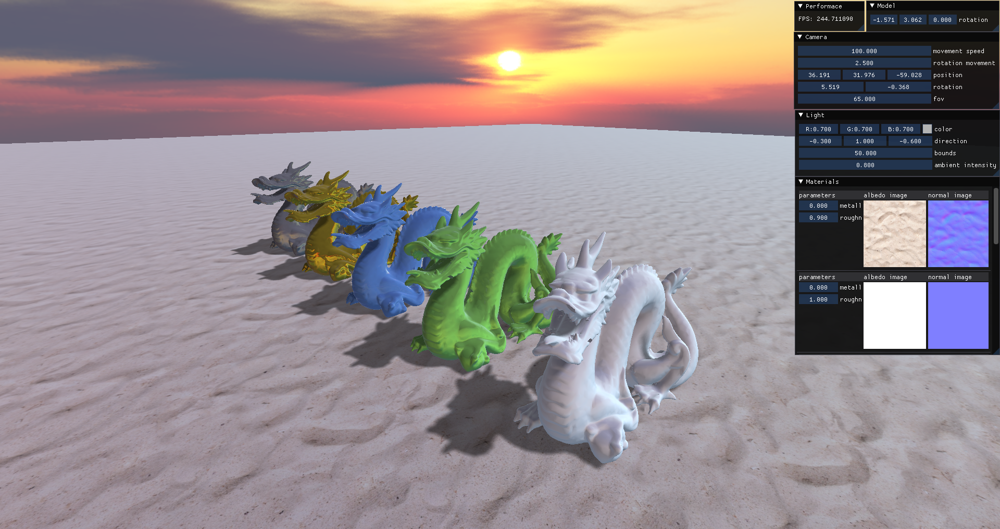
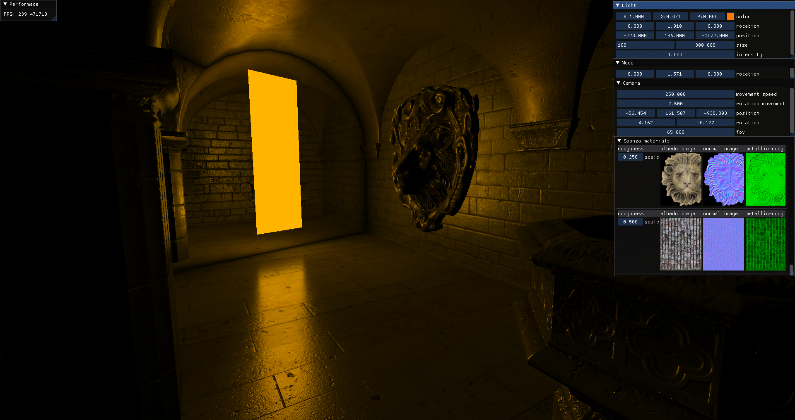
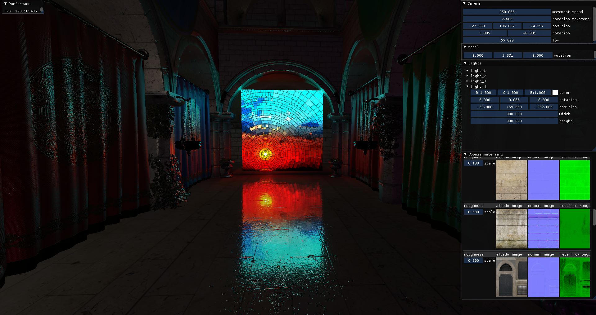
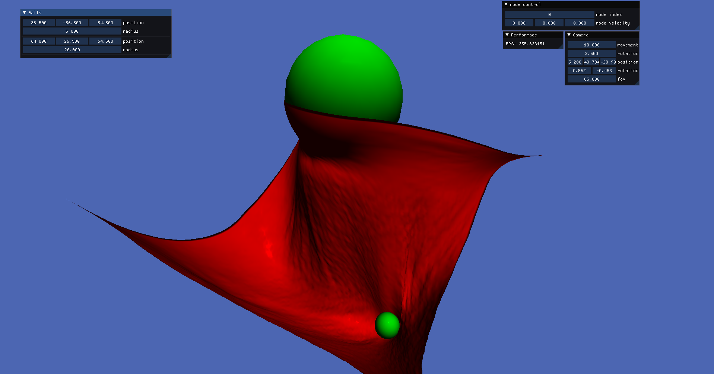

# VulkanAbstractionLayer

WIP library for abstracting Vulkan API to later use in my projects (including [MxEngine](https://github.com/asc-community/MxEngine))


## Supported features
- loading obj and gltf objects (multiple submeshes, pbr materials)
- loading png, jpg, tga, bmp, dds, zlib-packed images (mip-maps, automatic format selection)
- virtual frames, staging buffers, mipmap generation (via blitImage)
- render graph with automatic attachment creation, descriptor set allocation and barrier placement
- imgui integration (with support of textures)
- vertex/fragment shaders, compute shaders, from-source shader compilation and reflection

## Installation
1. clone to your system using: `git clone --recurse-submodules https://github.com/vkdev-team/VulkanAbstractionLayer`
2. make sure you have Vulkan SDK installed (Vulkan 1.2 is recommended)
3. build examples by running main `CMakeLists.txt`

If you want to use the library in your CMake project:
```cmake
add_subdirectory(VulkanAbstractionLayer)
target_include_directories(TARGET PUBLIC ${VULKAN_ABSTRACTION_LAYER_INCLUDE_DIR})
target_link_libraries(TARGET PUBLIC VulkanAbstractionLayer)
```

## Minimal example
```cpp
#include "VulkanAbstractionLayer/Window.h"
#include "VulkanAbstractionLayer/VulkanContext.h"

using namespace VulkanAbstractionLayer;

int main()
{
    WindowCreateOptions windowOptions;
    windowOptions.Position = { 300.0f, 100.0f };
    windowOptions.Size = { 1280.0f, 720.0f };

    Window window(windowOptions);

    VulkanContextCreateOptions vulkanOptions;
    vulkanOptions.VulkanApiMajorVersion = 1;
    vulkanOptions.VulkanApiMinorVersion = 2;
    vulkanOptions.Extensions = window.GetRequiredExtensions();
    vulkanOptions.Layers = { "VK_LAYER_KHRONOS_validation" };

    VulkanContext Vulkan(vulkanOptions);
    SetCurrentVulkanContext(Vulkan);

    ContextInitializeOptions deviceOptions;
    deviceOptions.PreferredDeviceType = DeviceType::DISCRETE_GPU;

    Vulkan.InitializeContext(window.CreateWindowSurface(Vulkan), deviceOptions);

    window.OnResize([&Vulkan](Window& window, Vector2 size) mutable
    { 
        Vulkan.RecreateSwapchain((uint32_t)size.x, (uint32_t)size.y); 
    });
    
    while (!window.ShouldClose())
    {
        window.PollEvents();

        if(Vulkan.IsRenderingEnabled())
        {
            Vulkan.StartFrame();
            // rendering
            Vulkan.EndFrame();
        }
    }

    return 0;
}
```

## Render Graph
Describe RenderPass (can be abstract, not necessary containing actual shader):
```cpp
class SomeRenderPass : public RenderPass
{    
public:
    OpaqueRenderPass()
    {
        // initialization code
    }

    virtual void SetupPipeline(PipelineState pipeline) override
    {
        // load shader
        pipeline.Shader = std::make_unique<GraphicShader>(
            ShaderLoader::LoadFromSource("vertex.glsl", ShaderType::VERTEX, ShaderLanguage::GLSL),
            ShaderLoader::LoadFromSource("fragment.glsl", ShaderType::FRAGMENT, ShaderLanguage::GLSL)
        );

        // describe vertex buffer bindings
        pipeline.VertexBindings = {
            VertexBinding{
                VertexBinding::Rate::PER_VERTEX,
                3,
            },
            VertexBinding{
                VertexBinding::Rate::PER_INSTANCE,
                2,
            },
        };

        // describe descriptor bindings per descriptor set
        pipeline.DescriptorBindings
            .Bind(0, "UniformBuffer", UniformType::UNIFORM_BUFFER)
            .Bind(1, textureSampler, UniformType::SAMPLER)
            .Bind(2, "Textures", UniformType::SAMPLED_IMAGE);

        // add output attachments
        pipeline.AddOutputAttachment("Output", ClearColor{ 0.5f, 0.8f, 1.0f, 1.0f });
        pipeline.AddOutputAttachment("OutputDepth", ClearDepthSpencil{ });
    }

    virtual void ResolveResources(ResolveState state) override
    {
        // resolve resource names to exact resources
        state.Resolve("UniformBuffer", uniformBuffer);
        state.Resolve("Textures", textures);
    }
    
    virtual void OnRender(RenderPassState state) override
    {
        state.Commands.SetRenderArea(state.GetAttachment("Output"));

        // draw some stuff
        state.Commands.BindVertexBuffers(vertexBuffer);
        state.Commands.BindIndexBufferUInt32(indexBuffer);
        state.Commands.PushConstants(state.Pass, &pushConstants);
        state.Commands.DrawIndexed(indexCount, instanceCount);
    }
};
```

Build render graph from render passes:
```cpp
// some passes like ImGuiRenderPass are supported out of box

RenderGraphBuilder renderGraphBuilder;
    renderGraphBuilder
        .AddRenderPass("SomePass", std::make_unique<SomeRenderPass>(parameters))
        .AddRenderPass("ImGuiPass", std::make_unique<ImGuiRenderPass>("Output"))
        .SetOutputName("Output");

RenderGraph renderGraph = renderGraphBuilder.Build();
```

Execute render graph each frame:
```cpp
auto& Vulkan = GetCurrentVulkanContext();

while (!window.ShouldClose())
{
    window.PollEvents();
    if (Vulkan.IsRenderingEnabled())
    {
        Vulkan.StartFrame();

        renderGraph.Execute(Vulkan.GetCurrentCommandBuffer());
        renderGraph.Present(Vulkan.GetCurrentCommandBuffer(), Vulkan.AcquireCurrentSwapchainImage(ImageUsage::TRANSFER_DISTINATION));

        Vulkan.EndFrame();
    }
}
```

## Some Examples

*simple shadow mapping*

*ibl lighting*

*area light from [LTC paper](https://eheitzresearch.wordpress.com/415-2/)*

*textured light from [LTC paper](https://eheitzresearch.wordpress.com/415-2/)*

*cloth simulation based on compute shader*
