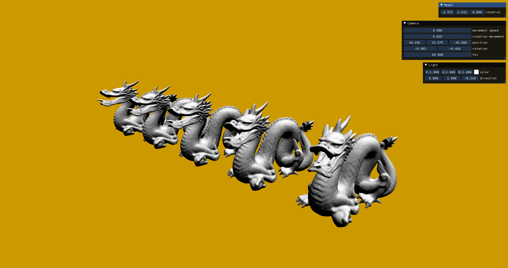

# VulkanAbstractionLayer

WIP library for abstracting Vulkan API to later use in my projects (including [MxEngine](https://github.com/asc-community/MxEngine))


## Installation
1. clone to your system using: `git clone --recurse-submodules https://github.com/MomoDeve/VulkanAbstractionLayer`
2. make sure you have Vulkan SDK installed (Vulkan 1.2 is recommended)
3. build examples by running main `CMakeLists.txt`

If you want to use the library in your CMake project:
```cmake
add_subdirectory(VulkanAbstractionLayer)
target_include_directories(TARGET PUBLIC ${VULKAN_ABSTRACTION_LAYER_INCLUDE_DIR})
target_link_libraries(TARGET PUBLIC VulkanAbstractionLayer)
```

## Minimal example
```cpp
#include "VulkanAbstractionLayer/Window.h"
#include "VulkanAbstractionLayer/VulkanContext.h"

using namespace VulkanAbstractionLayer;

int main()
{
    WindowCreateOptions windowOptions;
    windowOptions.Position = { 300.0f, 100.0f };
    windowOptions.Size = { 1280.0f, 720.0f };

    Window window(windowOptions);

    VulkanContextCreateOptions vulkanOptions;
    vulkanOptions.VulkanApiMajorVersion = 1;
    vulkanOptions.VulkanApiMinorVersion = 2;
    vulkanOptions.Extensions = window.GetRequiredExtensions();
    vulkanOptions.Layers = { "VK_LAYER_KHRONOS_validation" };

    VulkanContext Vulkan(vulkanOptions);
    SetCurrentVulkanContext(Vulkan);

    ContextInitializeOptions deviceOptions;
    deviceOptions.PreferredDeviceType = DeviceType::DISCRETE_GPU;

    Vulkan.InitializeContext(window.CreateWindowSurface(Vulkan), deviceOptions);

    window.OnResize([&Vulkan](Window& window, Vector2 size) mutable
    { 
        Vulkan.RecreateSwapchain((uint32_t)size.x, (uint32_t)size.y); 
    });
    
    while (!window.ShouldClose())
    {
        window.PollEvents();

        if(Vulkan.IsRenderingEnabled())
        {
            Vulkan.StartFrame();
            // rendering
            Vulkan.EndFrame();
        }
    }

    return 0;
}
```

## Some Examples
